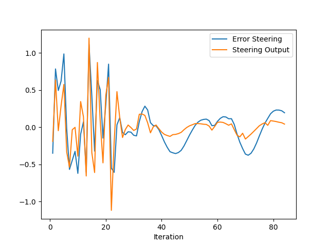
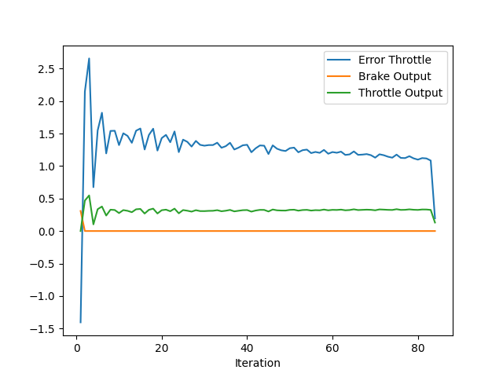

# Evaluate and analyze the PID controller

## Answers to the questions

### Add the plots to your report and explain them (describe what you see)
Below is the plot of the result obtained from the pid controller.

The upper plot shows the steer error between desired trajectory and actual trajectory the vehicle followed using inputs from the pid controller. We can see the error is oscillating at first, but reduced as time passes. This is probablly because the situation is more complex in the beginning where two cars are parked close together, than the latter part.

The lower plot shows the throttle error. We can see the error is highter compared to the steer.

### What is the effect of the PID according to the plots, how each part of the PID affects the control command?

- P is the proportional term, which simply brings output closer to target value. As we can see this effect from the plot, the error fluctuates around 0.

- I is the integral term, which will help hold output to target value. We can't see the effect clearly from the plot, but in an environment where disturbance works, we will clearly see the effect of this term.

- D is the derivative term, which will supress the overshoot and oscillations. However, as menthoned above, the error is oscillating. So we might not get the enough effect of this term.

### How would you design a way to automatically tune the PID parameters?

We can use this error plot. For example, the following methods could be considered.

- set the initial value of PID parameters
- test the controller
- calculate the sum of the error from the plot
- use the sum as cost and apply some optimization algorythms to tune PID values  

### PID controller is a model free controller, i.e. it does not use a model of the car. Could you explain the pros and cons of this type of controller?

Pros:

- simple and easy to implement
- effective in systems with relatively simple dynamics

Cons:

- less effective in systems with complex dynamics
- unstable if not properly tuned

### (Optional) What would you do to improve the PID controller?

- implement the code automatically tuning the PID parameters as menthoned above.

- tune the other parameters in behavior planner or motion planning module. 

